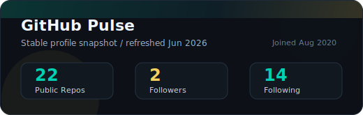

  

  
  
  

  

## About / 关于我

**中文** — 我是 **Tutict White**，GitHub ID 是 [`tutict`](https://github.com/tutict)。我关注把想法推进成可运行、可验证、可维护的系统：从 AI 工作流、金融研究智能体、本地桌面 Agent 工作台，到 Flutter 移动端、Java/Quarkus 后端和自动化工具链。

**English** — I am **Tutict White**, known as [`tutict`](https://github.com/tutict) on GitHub. I build practical systems that turn ideas into runnable, testable, and maintainable software: AI workflow platforms, financial research agents, local-first desktop agent workbenches, Flutter clients, Java/Quarkus services, and automation tooling.

> 钱冇样衰人戆居

## Current Focus / 当前重点

| Direction / 方向 | What I build / 构建内容 | Representative work / 代表项目 |
| --- | --- | --- |
| AI agents & workflow / AI 智能体与工作流 | Agent 编排、交付运行记录、Prompt-to-Playable、RAG 和验证修复闭环 Agent orchestration, delivery runs, Prompt-to-Playable, RAG, and verify-repair loops | [`gp-assistant`](https://github.com/tutict/gp-assistant), [`enterprise-insight-platform`](https://github.com/tutict/enterprise-insight-platform), [`Fantasy-Agent`](https://github.com/tutict/Fantasy-Agent) |
| Local-first desktop tools / 本地优先桌面工具 | Tauri/Rust/React 桌面工作台、本地持久化、安全配置、离线可用能力 Desktop workbenches, local persistence, secure settings, and offline-friendly flows | [`MMGH`](https://github.com/tutict/MMGH), [`DevQRH`](https://github.com/tutict/DevQRH), [`MicroFlow`](https://github.com/tutict/MicroFlow) |
| Product systems / 产品系统 | Flutter 客户端、Java/Quarkus 后端、业务流程、协作与管理工具 Flutter clients, Java/Quarkus backends, business workflows, collaboration, and admin tools | [`Final-Assignment`](https://github.com/tutict/Final-Assignment), [`kiniu`](https://github.com/tutict/kiniu), [`neusoft-hospital`](https://github.com/tutict/neusoft-hospital) |

## Tech Stack

  
  
  
  
  
  
  
  
  
  
  
  
  
  
  

## Selected Projects

<table>
  <tr>
    <td width="50%">
      
    </td>
    <td width="50%">
      
    </td>
  </tr>
  <tr>
    <td width="50%">
      
    </td>
    <td width="50%">
      
    </td>
  </tr>
  <tr>
    <td width="50%">
      
    </td>
    <td width="50%">
      
    </td>
  </tr>
</table>

## Project Snapshot / 项目速览

| Project | 中文 | English |
| --- | --- | --- |
| [`gp-assistant`](https://github.com/tutict/gp-assistant) | 面向 A 股研究的智能选股助手，覆盖行情观察、条件选股、关系图选股、趋势指标、回测验证和产业链消息 RAG | An A-share research assistant with market views, screeners, relationship-graph selection, trend signals, backtesting, and industry-chain RAG |
| [`enterprise-insight-platform`](https://github.com/tutict/enterprise-insight-platform) | 面向 FDE 交付的 AI 工程工作台，把业务分析、代码扫描、Playbook、Agent 执行、验证修复和交付证据串成可审计链路 | An FDE delivery workbench connecting business analysis, code scanning, playbooks, agent execution, verification, repair, and delivery evidence |
| [`Fantasy-Agent`](https://github.com/tutict/Fantasy-Agent) | AI 原生多智能体游戏生产平台，将玩法想法推进为可检查、可执行、可测试的 game jam 级原型流程 | An AI-native multi-agent game production platform for turning gameplay ideas into testable vertical-slice prototypes |
| [`DevQRH`](https://github.com/tutict/DevQRH) | Flutter 事故手册应用，桌面端可接入本地 Go RAG sidecar，在 Agent 页提供检索增强回答 | A Flutter incident handbook with an optional local Go RAG sidecar for grounded desktop answers |
| [`MicroFlow`](https://github.com/tutict/MicroFlow) | 本地优先的 AI 协作工作台，整合登录、工作区消息、WebSocket 实时通信、Agent 调用和部署配对 | A local-first AI collaboration workspace with auth, workspace chat, realtime messaging, agent runs, and pairing flows |
| [`MMGH`](https://github.com/tutict/MMGH) | Rust + Tauri + React 桌面 Agent 工作台，整合会话、知识、提醒、技能和日常任务流 | A Rust, Tauri, and React desktop agent deck for conversations, knowledge, reminders, skills, and daily workflows |
| [`Final-Assignment`](https://github.com/tutict/Final-Assignment) | 交通违法处理管理系统，采用 Flutter 前端与 Java 后端架构 | A traffic violation handling management system built with Flutter frontend and Java backend architecture |
| [`kiniu`](https://github.com/tutict/kiniu) | 围绕 AI 角色扮演议题持续开发的 Java 项目 | A Java project developed around an AI role-playing product idea |

## GitHub Pulse

  
  

  

## Connect

  
  

  

