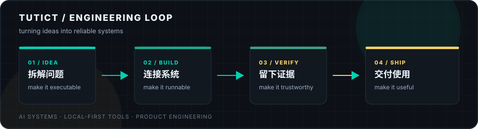

  

<h1 align="center">Tutict White</h1>

  <strong>把想法推进成可运行、可验证、可维护的系统。</strong>

  <code>AI systems</code> · <code>local-first tools</code> · <code>product engineering</code>

  <a href="https://github.com/tutict">GitHub @tutict</a>
  ·
  <a href="https://github.com/tutict?tab=repositories">Explore repositories</a>

> 我喜欢把模糊的想法拆成可以运行的工作流，再用证据、测试和可复盘的交付记录把它做实。
>
> 钱冇样衰人戆居。

## Engineering Console / 工程控制台

| Signal | Current state |
| --- | --- |
| `BUILDING` | AI agents、workflow tools、local-first desktop apps |
| `METHOD` | evidence-first · 可验证 · 缺失不伪造 · 本地优先 |
| `SURFACES` | 桌面端 · 移动端 · 后端服务 · 游戏原型 |
| `STACK` | Rust · TypeScript · Python · Java · Dart · Flutter · Tauri |

## What I Build / 我在构建什么

| Direction | Focus |
| --- | --- |
| **AI agents & workflows** | Agent 编排、执行图、Prompt-to-Playable、RAG、验证与修复闭环。 |
| **Local-first tools** | 桌面工作台、离线可用、本地持久化、安全配置与可复盘运行记录。 |
| **Product systems** | Flutter 客户端、Java/Quarkus 服务、实时通信、异步事件与业务流程。 |

## Selected Systems / 代表项目

<table>
  <tr>
    <td width="50%" valign="top">
      <h3>01 · <a href="https://github.com/tutict/gp-assistant">gp-assistant</a></h3>
      
A 股研究与选股工作台，把行情观察、筛选、回测、新闻证据与 AI research agent 放进同一条研究链路。

      Rust · Tauri · React · quantitative finance
    </td>
    <td width="50%" valign="top">
      <h3>02 · <a href="https://github.com/tutict/Fantasy-Agent">Fantasy-Agent</a></h3>
      
AI 原生 Prompt-to-Playable 游戏生产工作台，把玩法想法推进成可检查、可执行、可测试的垂直切片。

      Python · multi-agent workflow · game prototyping
    </td>
  </tr>
  <tr>
    <td width="50%" valign="top">
      <h3>03 · <a href="https://github.com/tutict/MMGH">MMGH</a></h3>
      
本地优先的个人 Agent 工作台，连接会话、知识、提醒、技能和日常任务流。

      Rust · Tauri · React · local-first desktop
    </td>
    <td width="50%" valign="top">
      <h3>04 · <a href="https://github.com/tutict/enterprise-insight-platform">enterprise-insight-platform</a></h3>
      
面向 FDE 交付的 AI workflow 工作台，把执行图、代码扫描、Agent 运行、验证修复和交付证据串起来。

      Java · workflow orchestration · delivery evidence
    </td>
  </tr>
  <tr>
    <td width="50%" valign="top">
      <h3>05 · <a href="https://github.com/tutict/MicroFlow">MicroFlow</a></h3>
      
本地优先的 AI 协作工作台，整合工作区消息、实时通信、Agent 调用和部署配对。

      Dart · Flutter · WebSocket · collaboration
    </td>
    <td width="50%" valign="top">
      <h3>06 · <a href="https://github.com/tutict/Final-Assignment">Final-Assignment</a></h3>
      
Flutter + Spring Boot 全栈业务系统，覆盖权限、异步事件、RAG、实时进度和工程化实验。

      Java · Spring Boot · Flutter · Kafka
    </td>
  </tr>
</table>

## How I Work / 我怎么做

1. **先把问题变成可执行的工作流**：明确输入、边界、工具调用和交付结果。
2. **让结果带着证据**：保留来源、时间、缺失项、运行记录和可以复核的中间状态。
3. **缺失不伪造**：没有数据就明确标注，不用看起来完整的假值掩盖不确定性。
4. **把验证放回闭环**：测试、回测、运行复盘、修复和再次验证都属于产品的一部分。

## Toolkit / 技术栈

| Capability | Tools & concepts |
| --- | --- |
| **AI & Workflow** | `LangGraph` · `RAG` · `Agent orchestration` · `Prompt-to-Playable` · `backtesting` |
| **Desktop & Client** | `Rust` · `Tauri` · `React` · `TypeScript` · `Flutter` · `Dart` |
| **Backend** | `Java` · `Spring Boot` · `Quarkus` · `Python` · `FastAPI` · `Go` |
| **Engineering** | `Kafka` · `WebSocket` · `CI/CD` · `local-first` · `verification` |

## Other Builds / 其他实验

- [`DevQRH`](https://github.com/tutict/DevQRH) — Flutter 故障处置手册 + 本地 Go RAG sidecar。
- [`GamePulse`](https://github.com/tutict/GamePulse) — 持续探索中的 TypeScript 游戏项目。
- [`kiniu`](https://github.com/tutict/kiniu) — 围绕 AI 角色扮演议题持续开发的 Java 项目。
- [`emacs-lisp-reference-manual-zh_cn`](https://github.com/tutict/emacs-lisp-reference-manual-zh_cn) — 面向中文阅读体验的 Emacs Lisp 手册整理。
- [`vim-settings`](https://github.com/tutict/vim-settings) — 长期使用的 Vim 配置与工作流记录。

## GitHub Signal / 活动信号

动态统计不应该遮住真正的作品。主页首屏使用本地工程流程卡片，项目状态与最新代码以 GitHub 仓库为准：

- [查看完整活动记录](https://github.com/tutict)
- [浏览所有公开仓库](https://github.com/tutict?tab=repositories)

## Connect / 联系

  <a href="https://github.com/tutict">GitHub @tutict</a>
  ·
  <a href="https://github.com/tutict?tab=repositories">所有公开仓库</a>

  Build deliberately. Verify honestly. Ship something useful.

